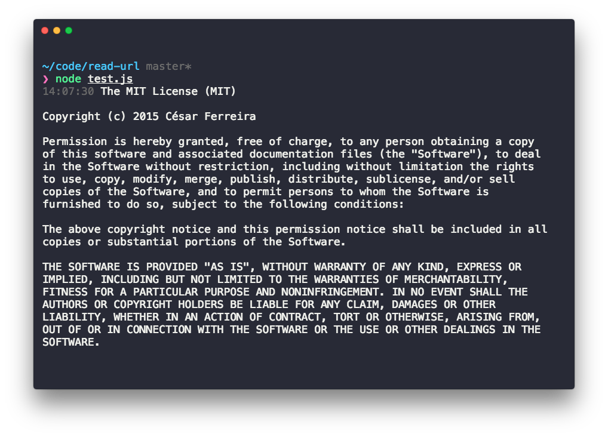

# node-read-url
> Reads an URL into a string

<p align="center">
  
</p>

[](https://travis-ci.org/cesarferreira/node-read-url)
[](https://www.npmjs.com/package/node-read-url)
[](https://www.npmjs.com/package/node-read-url)

## Install

```sh
yarn add node-read-url
```

## Usage

```js
require('node-read-url')
  .promise('https://raw.githubusercontent.com/cesarferreira/dryrun/master/LICENSE')
  .then(response => {
    console.log(response)
  })
  .catch(err => {
    console.log(err)
  });

```

## Created by
[Cesar Ferreira](https://cesarferreira.com)

## License
MIT © [Cesar Ferreira](http://cesarferreira.com)
